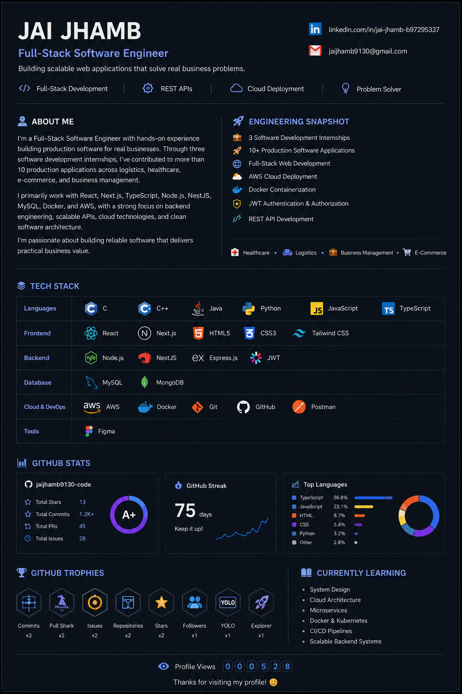

  

<h1 align="center">Hi 👋, I'm Jai Jhamb</h1>

<h3 align="center">Full-Stack Software Engineer</h3>

Building production software with React • Next.js • TypeScript • Node.js • NestJS • Docker • AWS

&nbsp;

---

# 👨‍💻 About Me

I'm a **Full-Stack Software Engineer** with hands-on experience building production software for real businesses. Through **three software development internships**, I've contributed to **10+ production applications** across logistics, healthcare, e-commerce, and business management.

My primary stack includes **React, Next.js, TypeScript, Node.js, NestJS, MySQL, Docker, AWS, MongoDB, and Express.js**. I enjoy designing scalable backend systems, building secure REST APIs, and deploying cloud-ready applications with clean, maintainable architecture.

---

# 🚀 Engineering Snapshot

- 💼 3 Software Development Internships
- 🚀 10+ Production Software Applications
- 🌐 Full-Stack Web Development
- ☁️ AWS Cloud Deployment
- 🐳 Docker Containerization
- 🔐 JWT Authentication & Authorization
- 📡 REST API Development
- 🏥 Healthcare Solutions
- 🚛 Logistics Platforms
- 🛒 E-Commerce Applications
- 📊 Business Management Software

---

# 💻 Tech Stack

### 💻 Languages

### ⚛️ Frontend

### ⚙️ Backend

### 🗄️ Database

### ☁️ Cloud & DevOps

### 🛠️ Tools

---

# 📊 GitHub Analytics

---

# 🏆 GitHub Trophies

---

# 🌱 Currently Exploring

- 🏗️ System Design
- ☁️ Cloud Architecture
- 🐳 Docker & Kubernetes
- ⚙️ Microservices
- 🚀 CI/CD Pipelines
- 📡 Scalable Backend Systems

---

⭐ **Thanks for visiting my profile! Feel free to explore my repositories and connect with me.**

